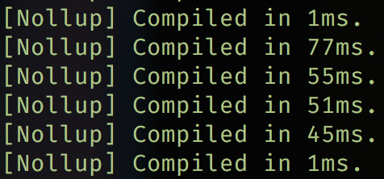

# Svelte TS Hot 🔥

This is a copy of [Svelte Template Hot](https://github.com/rixo/svelte-template-hot) with added Typescript and PostCSS support.

- 🙅‍♂️ [Nollup](https://github.com/PepsRyuu/nollup)
- 🆃 [Typescript](https://www.typescriptlang.org/)
- 𝒮 [SCSS](https://sass-lang.com/)
- 🔷 [CSSNano](https://cssnano.co)

&nbsp;



&nbsp;

## Quick start

```bash
$ npx degit FractalHQ/svelte-ts-hot svelte-ts-hot
```

```bash
$ cd svelte-ts-hot && yarn && yarn build && yarn dev
```

&nbsp;

Progress of Svelte HMR support can be tracked in issues [3832](https://github.com/sveltejs/svelte/issues/3632) and [3822](https://github.com/sveltejs/svelte/pull/3822).

&nbsp;

> "Nollup implements the shortest possible path from a file change to the module reloaded in the browser and is all in-memory. Said otherwise, it is insanely fast. Also, it has been around for some time so it is quite battle tested already." -Senpai [Rixo](https://github.com/rixo)
